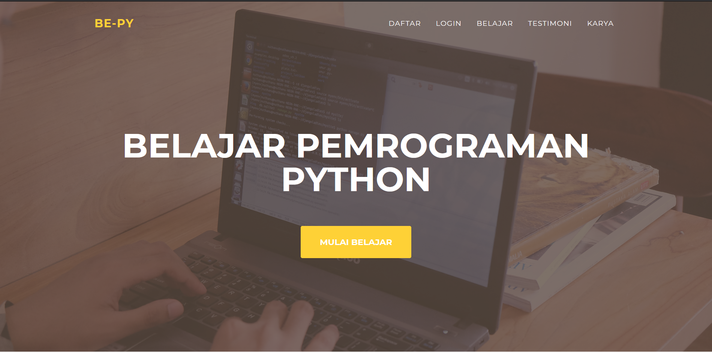

# Overview
Bepy merupakan platform pembelajaran pengembangan perangkat lunak menggunakan bahasa pemrograman python. Materi pembelajaran akan ditulis dalam bahasa Indonesia. Materi pembelajaran terdiri dari dasar bahasa pemrograman python, membuat full stack website dengan django, membuat api dengan django rest framework, membuat microservice dengan flask dan lain lain.

# Functional Requirement
* Bisa melihat list pelajaran
* Bisa melihat part pelajaran
* Bisa melihat detail part pelajaran

# Technical Requirement
* Bahasa Pemrograman: Python
* Web Framework: Django
* Platform: Web Browser
